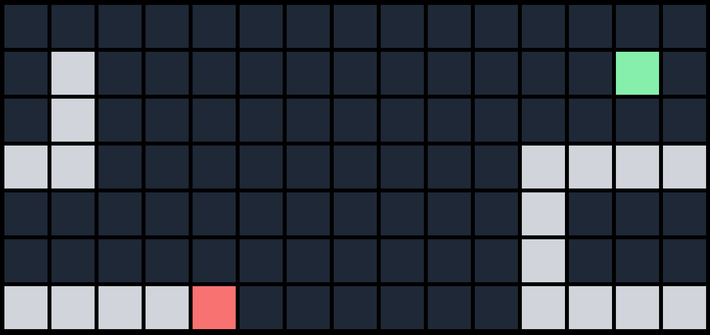

# Snake

This repository contains an implementation of the classic game of snake. 

## Controls

Use arrow keys to control movement.

## Objective

The objective is to navigate the snake, which head is indicated by the red square, to the green square. Every time the snake enters a green square, the snake grows one square in length. The grown part of the snake are the gray squares. If you collide with a gray square the game restarts. 

The game does not keep any score.